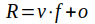

## Import	

**Select, extract, calibrate, clip, warp and scale image archives**

*Import* includes all necessary tools to provide a seamless image for a selected region (ROI) from a collection of compressed satellite image archives as shipped by the providers. Projection, acquisition period, quality, calibration, frame and bands can be selected as needed. The result is a collection of images with one multiband layer for each acquisition date. If the ROI is dissipated over different archives, *import* merges the different parts to a seamless result. The results is stored at the working directory and named using sensor type, tile ID and date. 

Images can be selected directly by the filename of the archive (*select*) or using a database [catalog](2_Catalog.md) with archive metadata. The filename passed to *select* may contain wildchars (*,?) to select more than one image. To search among a larger collection of image archives, a *database* must be created with the  [catalog](2_Catalog.md) command. *Distance* and *frame* below *database* select archives that cover at least parts of the passed *frame*. The acquisition date is selected by *period*.

The *frame*, *quality*, *bands*, *factor*, *offset*, *warp* and *pixel* input is used to quality the selection and prepare the imported result. They are compatible with both the *select* and the *database* process. *Frame* cuts the result to the passed boundaries. *Bands* extracts only the passed bands. *Factor* and *offset* calibrate the image values to a necessary value like reflectance or radiation. *Warp* and *pixel* transfer the import to any coordinate system that has an EPSG number.

If the selected ROI (*frame*) is dissipated over different archives of the same flight path of the satellite, the images are merged automatically. Different flight paths can be merged with the [compile](4_Compile.md) command. As different flight paths may differ considerable it seems reasonable to allow an individual control after the import.

------

### Database

**Select an image archive collection database**

`database = filename of an imalys catalog`

*Database* selects image archives as specified by *distance*, *frame* and *period* and extracts them to the working directory. *Database* must be the filename of a [catalog](2_Catalog.md). *Distance* controls the overlap between the *frame* and the tile of the image archive. *Period* controls the acquisition dates. 

------

### Select

**Select image archives by a filename mask**

`select = image archive filename with wildchars (*,?)`

*Select* extracts image data from a compressed archive to the working directory. Only archive names that share the given string will be selected. The image format is converted to the ENVI convention. *Select* can be repeated as often as necessary.

------

### Distance

**Select the minimum coverage of the archive for a given frame**

`distance = positive figure`	(only with *database*)

*Distance* controls the largest distance between the center of the selected *frame* and the center of the image archive. The input “1.0” is scaled to the radius of the archived tile. If a *distance* of “1.0” is given, the boundary of the archived image will at least reach the center of the frame. If the frame is larger than the archived tiles, larger *distance* values must be given.

------

### Period

**Select a time interval for image acquisition**

`YYYYMMDD – YYYYMMDD`	with Y=year, M=month and D=day	(only with *database*)

*Period* controls the accepted acquisition dates of the archived images. The *period* must be given as shown above. *Period* relays on the date in the file name.

------

### Frame

**Cut out parts of the images**

`frame = filename of a geometry`

Satellite images are provided in partly overlapping tiles. A polygon or at least three vector points given as a geometry file can be used to define a Region Of Interest (ROI). If a ROI is given each archive image is clipped to this ROI. If the ROI is dissipated over different tiles, *Imalys* tries to combine them to one seamless image.

------

### Quality

**Apply a quality mask to reject images**

`quality = figure between 0 and 1`

The *quality* parameter defines the lowest partition of undisturbed pixels in the passed *frame* Most of the public remote sensing images are shipped with a quality mask. This mask can be used to cut out image disturbances. *Imalys* uses the quality mask to reject images with more errors than the given limit.

------

### Bands

**Select bands to be extracted from the archive**

`bands = string, string, …`

*Bands* allows to restrict the extraction to specified bands. The selection must be given as a comma separated list of band names as the provider calls them.

------

### Factor, Offset

**Calibrate raw image data to a defined product**

`factor = positive figure`
`offset = figure`

Satellite images are provided with values that support easy storage and transportation. For image analysis it is strongly recommended to use atmospherically corrected reflectance (reflection) or radiation. 

The input is sensor dependent and may change between the different product levels of the provider. Calibration values are part of the metadata of the image archives but sometimes they are difficult to find. Examples for most common sensors are given in the [tutorial](../tutorials).

​		R: Result value; v: Value (original); f: Factor (as given); o: Offset (as given)

------

### Warp, Pixel 

**Reproject images and define a pixel size**

`warp = EPSG-number`
`pixel = pixel size in Meters`

To use different images of the same region or to adopt images to given maps the projection and the pixel size can be changed. The process depends on the image type. Maps and classified images are reprojected using the nearest neighbor principle. All other images are interpolated by a bicubic convolution process.

*Warp* expects an EPSG number as new projection. *Pixel* changes the pixel size during the reprojection process. *Warp* and *pixel* can be used also if only the pixel size is to be changed. 

------

### Example

```
IMALYS [import]
…
import
	database = /home/*user*/ESIS/archives/tilecenter.csv
	distance = 1.00
	frame = /home/*user*/ESIS/frames/c7106.gpkg
	quality = 0.86
	period = 20220501 - 20220731
	bands = _B2, _B3, _B4, _B5, _B6, _B7
	factor = 2.75e-5
	offset = -0.2
	warp = 32632
	pixel = 30
```

This import command selects all archives located up to one tile radius from the center of the *frame* (ROI). A maximum of 14% cloud cover and acquisition dates between May 01 and June 31 are accepted. The six optical bands 2…7 of the Landsat OLI sensor will be extracted and calibrated to TOA reflectance. The projection will be transformed to Zone 32, UTM, WGS84 if necessary. 

Alternatively the archives can be selected directly using the *select* parameter.

------

[Index](0_Index.md)
