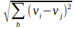
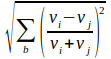
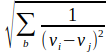
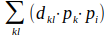

## Kernel	

**extract context features of each pixel using a moving window** 

*Kernel* processes collect values in the neighborhood of each pixel and combine them to a new value. The “neighborhood” is a small square window (kernel) that is moved over the whole image. The *execute* parameter can be repeated as often as needed to apply different processes to one image. The results will be named as the process. 

The processes *texture*, *normal*, *inverse*, *deviation* and *entropy* return information about the local diversity of the landscape. *Texture* collects the differences between all pixel neighbors within the kernel and returns the spectral “roughness” of the image. The *normal* process does the same but with normalized values that makes the result independent of illumination or object brightness. The *inverse* process returns the “Inverse Difference Moment IDM” after Haralik⁵ to analyze dark regions. 

Unlike the “roughness” of an image, Rao’s *deviation* return the diversity of all values within the given kernel. The result is insensitive to the spatial distribution of the pixels within the kernel. A chessboard like distribution of two values will produce the highest possible texture while the *deviation* is only moderate. 

The *lowpass*, *highpass* and *laplace* processes change the contrast of the given image. High- and lowpass enhance or reduce the overall contrast, *laplace* is specialized for edge detection. 

The *elevation* and *hillshade* processes are dedicated for elevation models. *Elevation* creates a three layers result with slope, exposition and shade of the elevation model. The *hillshade* process can superimpose illumination and shading of the elevation model to another image.

Kernel processes are always accompanied by a soft focus effect. The [features]() command offers the possibility to run texture processes using zones instead of kernels and retain the spatial resolution.

------

### Select

**Mark one image at the working directory to be processed**

`select = filename`

More than one image can be processed at the same time if they are stacked using the [compile](4_Compile.md) command

------

### Radius

**Select the kernel size**

`radius = number`	(kernel radius in pixels)

The kernel radius is defined as the number of pixels between the center and the border of the kernel. The input `radius = 1` produces a 3x3 pixels kernel. Zero is not accepted.

------

### Texture

**Extract the local texture of each pixels environment**

`execute = texture`

The *texture* process extracts the differences between each pixel and its neighbors within a small window (kernel) and stores the first principal component of all differences to a new layer.

​		v: pixel value; i,j: adjacent pixels

------

### Normal

**Extract a density normalized texture of each pixels environment**

`execute = normal`

The normalized texture does the same as *texture* but with normalized brightness. Value differences in bright regions like industrial areas will be high even if the relative differences are low. The opposite is true for dark forests. 

​		vi: pixel value; vj: neighbor pixel value; b: bands

------

### Inverse

**Inverse Difference Moment (IDM)**

`execute = inverse`

The *inverse* process creates a new image with the Inverse Difference Moment (IDM) proposed by Haralik⁵. The result is particularly high in dark regions and low in bright regions. It can complement *texture* and has proved useful in the analysis of settlement structures.

​		v: values; i,j: neighbor pixels; b: bands

------

### Deviation

**Rao‘s diversity based on pixels**

`execute = deviation`

Rao’s diversity uses variance instead of texture to evaluate the spectral diversity of landscape structures. The variance is insensitive for the spatial distribution of the pixels within the kernel. 

*This process is deprecated. We recommend to use Rao’s diversity based on zones (see Appendix D: Features:Entropy).*

​		dij: Density difference; I,j: neighbor pixels; 
​						pi, pj: frequency of pixel values “i” and “j”

------

### Entropy

**Rao‘s diversity based on classes**

see [mapping]() for details

Rao’s diversity can also be based on classes. The classes can exist or calculated by the [mapping]() command. Use *mapping* with the parameter *entropy* to apply the transformation.

*This process is deprecated. We recommend to use Rao’s diversity based on zones (see Appendix D: Features:Entropy).*

​		d: spectral distance between classes; 
​						p: class frequency; k,i: different classes

------

### Lowpass

**Reduce the local contrast**

`execute = lowpass`

The *lowpass* process reduces the local contrast of the image data according to the selected *radius*. *Lowpass* uses a kernel with a normalized Gaussian distribution. The kernel size can be selected freely. *Imalys* implements large kernels through an iterative process to significantly reduce the processing time.

​		v: image values; k: kernel values; I,j: kernel index

------

### Laplace

### inner, outer

**Enhance the local contrast**

`execute = laplace`
`inner = number (kernel radius)`
`outer = number (kernel radius)`

*Imalys* implements the Laplace transformation as the difference between two Gaussian distributions with a different radius. The parameters *inner* and *outer* control the size (kernel radius) of the two distributions. Most like *radius* the kernel size is defined as the number of pixels between the center and the border of the kernel. 

​		v: values; k: inner kernel; g: outer kernel; I,j: kernel indices

------

### elevation

**Extract slope, exposition and shade from an elevation model**

`execute = elevation`

The command generates three layers called “slope”, “exposition” and “shade” from any elevation model. See *hillshade* to superimpose images with shading.

------

### hillshade

**Superimpose image data with shading from an elevation model**

`execute = hillshade`

The *hillshade* process can superimpose the shading over each other image thus providing a 3D look to each other result.

------

### target

**Rename the result of the last command**

`target = filename`

The *target* option renames the result of the last command. The new name is restricted to the working directory. Only the last result will be affected. Choose the [export]() command to store one or more results at a different place.

------

### Example

```
IMALYS [kernel]
…
compile
	select=/home/*user*/ESIS/results/bands_summer.tif
	select=/home/*user*/ESIS/results/bands_autumn.tif
	target=period
kernel
	select=period
	execute=normal
	radius=2
	execute=laplace
	inner=1
	outer=3
```

For this example two images stored as Geo-Tiff at the users “results” directory are used to calculate two textures and the Laplace edge detection. External images must be stacked and stored in the working directory ([Compile](4_Compile.md)) before they can be processed. The new name “period” is assigned to call the kernel process. The process returns the textures using a 5x5 pixel kernel and the edge detection result with a 3:1 enhancement.

-----

[Index](0_Index.md)