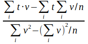
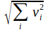
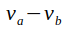
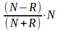
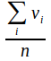

## Reduce	

**reduce image dimension by pixel based processing**

The reduce command summarizes all processes that reduce the number of bands in an image. Reduce includes band proportions like the vegetation index NDVI, statistical processes like the variance of a time course and quality issues like the median of an image collection. 

The *NirV*, *NDVI*, *EVI* and *LAI* index are proxies for biomass and mainly the metabolism rate of green plants. About 20 different approximations are described¹, some of them differ in details². The NirV index tries to quantify the photosynthetically active radiation (PAR) as a measure of plant metabolism³ that might be most important for the evaluation of environmental services.

The statistical processes *mean*, *difference*, *brightness*, *variance* and *regression* are calculated as defined. For multispectral images the result of each band is calculated separately. The result can be stored as a multispectral result or as a single layer using the *flat* option. The *regression* depends on precise timestamps. Using the [import](3_Import.md) command the acquisition date is registered at the images metadata. 

The *mean*, *median* and *principal* processes can be used for quality enhancement. The *bestof* process is a mixture of them that tries to select the most reliable combination of several images. *Bestof* relies on a quality indicator of the selected frame taken from the providers metadata. This indicator allows to decide wether a single but undisturbed image, the mean of two images or the median of three or more images is used for the result. The three options are evaluated individually for each pixel.

The *principal* component rotation tries to extract the most significant image properties to a smaller number of bands. The feature space is rotated to show a maximum of differences, the differences are stored as a new layer and the extracted layer is deleted from remainings. The process is repeated for the each result band.

*Reduce* accepts more than one *execute* call for the same image. All results are stored at the working directory and named as the process.

---

### Select

**Mark one image of the working directory to be processed**

`select = image filename`

More than one image can be processed at the same time if they are stacked using the [compile](4_Compile.md) command

---

### Variance

**Variance based on standard deviation**

`execute = variance`

The *variance* parameter determines the variance of individual pixels based on a standard distribution for all individual bands in the source image. The process returns a multispectral image of variances. If the *flat* parameter is added, the result will be reduced to one band.

​		v: values; i: items; n: item count

Range: [0 … positive values]

---

### Regression

**Regression based on standard deviation**

`execute = regression`

The *regression* parameter returns the regression of individual pixels of all bands in source. *Regression* tries to use the temporal distance of the recordings from the metadata of the images. To do this, the images must have been imported with the [import](3_Import.md) command. The process returns a multispectral image of regressions (see *variance*). Using the *flat* option the result is further reduced to one band.

​		t: time; v: values; i: items; n: item count

Range: [negative values … positive values]

---

### Flat

**Reduce all results to one band**

`flat = true`

Some *reduce* commands return multispectral results. The *flat* option reduces them to one single band. The *flat* process uses the first principal component of all bands to reduce a multispectral image to one band showing the overall brightness.

​		v: values; i: items

Range: [0 … positive values]

The process will convert negative values into positive ones.

---

### Difference

**Euklidian distance of two (multiband) images**

`execute = difference`

The process returns the difference between two images. For multispectral images the result is a multispectral image of differences. Using the *flat* option the result can be further reduced to one band.

​		v: pixel value

Range: [negative values … positive values]

---

### NirV, NDVI, EVI

**Near infrared vegetation index (NIRv)**
**Normalized vegetation Index (NDVI)**
**Enhanced vegetation index (EVI)**

`execute = NirV | NDVI | EVI`

Both the NIRv and the NDVI index are calculated as the product of near infrared radiation and the normalized difference of the red and the near infrared radiation. The NirV definition shows a better mapping at sparsely vegetated areas.

NirV: 	N: Near infrared value; R: Red band value

Range: [-1 … +1]

---

### LAI (deactivated)

**Leaf cover per area**

`execute = LAI`

The *LAI* parameter gives the proportion of leaf surface compared to the ground surface covered by the plants. The LAI was introduced as a proxy for field work. Simulated LAI values by means of estimating the photosynthetic active radiation (PAR) are of minor quality.

---

### Brightness

**First principal component of all bands**

`execute = brightness`

The process returns the brightness of all bands in the passed images. A stack of multispectral images is reduced to one multispectral image, a single image is reduced to a single band. *Brightness* uses the first principal component to reduce the passed bands. For a stack of multispectral images each band is reduced separately. Using the *flat* option the result is further reduced to one band.

​		v: values; i: items; 

Range: [0 … positive values]

The process will convert negative values into positive ones.

---

### Principal

**Principal component rotation**

`execute = principal`

The process extracts the first *count* (below) principal components from a n-dimensional image. The process tries to extract the most significant image properties to a smaller number of bands. 

The process extracts the most significant image property (overall brightness), stores it as the first band of the result, deletes the extracted property from the original data and repeats the process with the remainder. In many cases the information content of original can be concentrated to a few result bands. 

Range: [0 … positive values]

---

### Count

**Image dimensions after principal component rotation**

`count = number of new dimensions` (bands)  must be lesser than the original

only together with *principal*

The *count* parameter restricts the rotation to *count* steps. Without *count* the result of the rotations has one dimension less than the original.

---

### Mean

**Arithmetic mean of all bands**

`execute = mean`

The *mean* parameter gives the arithmetic mean of all image bands provided. For multispectral images, the result is individually calculated for each band. The process returns a multispectral image of mean values (see *variance*). Using the *flat* option the result is further reduced to one band.

​		v: values; i: items; n: item count

Range: [negative values … positive values]

---

### Median

**Most common value for each pixel from a stack of bands**

`execute = median`

The median reflects the most common value of each pixel in a stack of bands or images. For a stack of multispectral images the process returns a multispectral image of most common values for each band. Using the *flat* option the result is further reduced to one band. 

​	*Value in the middle of a sorted value list.*

Range: [negative values … positive values]

The *median* process can mask rare values. Clouds or smoke will disappear if more than the half of all pixels show undisturbed values.

---

### Bestof

**Automatically choose the most appropriate generalization**

`execute = bestof`

The *bestof* process returns an optimized image from one or more images with lesser quality. The typical import is a short time course. *Bestof* works better if the input images show no holes.

*Bestof* depends on the quality control of the [import](3_Import.md) command. If three ore more images exceed the minimum quality restraints the process returns the median of all passed pixels. If two images of equal quality are available, the process returns the mean of all pixels. If the quality differs for more than half of the indicator, only he better image is returned. If only one image is available, there is no choice.

---

### Target

**Rename the result of the last command**

`target = filename`

The *target* option renames the result of the last command. The new name is restricted to the working directory. Only the last result will be modified. Choose the [export](11_Export.md) command to store one or more results at a different place.

---

### Example

```
IMALYS [reduce]
…
reduce
	select=compile
	execute=bestof
	target=summer
reduce
	select=summer
	execute=NDVI
	red=2
	nir=3
	target=NDVI
```

In this example two *reduce* processes follow each other. The first reduces the result of the last [compile](4_Compile.md) command to one multispectral image. This does only make sense if the result of the *compile* command includes  several images (see second example under [compile](4_Compile.md)). The result is called "summer" to protect it from the second *reduce* process.

Without the *target* option the second *reduce* process would override the result of the first. The second *reduce* uses the result of the first one to calculate the normalized vegetation index. 

Files stored in the working directory can be called only by their name.

-----

[Previous](4_Compile.md)	–	[Index](Index.md)	–	[Next](6_Kernel.md)
