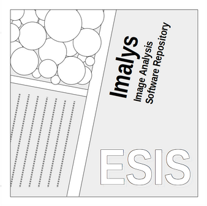

# **ESIS: EcoSystem Integrity Service**

EcoSystem Integrity Service – Remote Sensing, 16(7), 1139, https://doi.org/10.3390/rs16071139

Helmholtz GitLab (2022): https://codebase.helmholtz.cloud/esis/Imalys

**Peter Selsam, Angela Lausch, Jan Bumberger**

Department Monitoring and Exploration Technologies

Helmholtz Centre for Environmental Research GmbH – UFZ

Permoserstraße 15, 04318 Leipzig, Germany

peter.selsam@ufz.de, [www.ufz.de](http://www.ufz.de/)

-----
