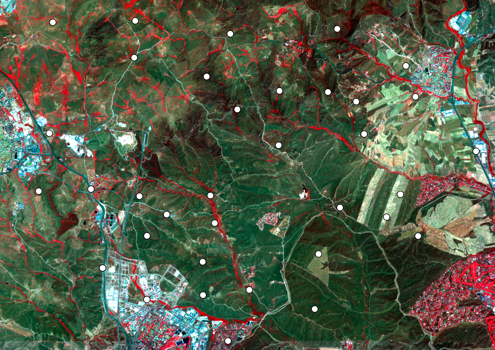

## T2a	Seamless image products

Satellite image data are shipped in compressed archives, the tracks are cut into tiles, different bands are stored to different files and the image values support compression. The [import](../manual/3_Import.md) and the [compile](../manual/4_Compile.md) command are designed to collect the necessary data and combine them to a seamless and calibrated image within a given frame. The second task of the [import](../manual/3_Import.md) process is to store all images with a common projection, pixel size and file format.



Selection points and image data for entomological research at the north of Madrid; Sensor: Sentinel-2; Bands: 8-4-3 (Infrared); Date: 12 June 2021; Calibration: TOA Reflectance; Section: Test area; Source: ESA

------

The [import](../manual/3_Import.md) command uses a lot of parameters to return most appropriate images. *Select* accepts the archive name, *frame* cuts the scene to a given region, *period* selects the acquisition time, *quality* rejects images with more than the given partition of errors, *cover* rejects sources with less than the given coverage of the *frame*, *warp* and *pixel* change the projection and finally *factor* and *offset* transfer the result into calibrated values. Except of *select*, none of these parameters are mandatory. 

-----

### T2a	Extract, calibrate and crop images

The first tutorial will import the 6 optical bands of 4 known Landsat images, cut them to the frame to a ROI (Region Of Interest) and calibrate the results to TOA (Top Of Atmosphere) reflectance.

If the image source is known, the archive name(s) can be given with ***select***. *Select* can be repeated as often as necessary. The archives must exist. 

*Select* without *frame* will import the whole tile. The ***frame*** process cuts out the ROI. *Imalys* expects a vector file do define the ROI. The result will be a rectangle including all points of the given geometry.

By default *import* will extract each image of the archive. This will be rarely necessary and the calibration can depend on the image type. Optical and thermal **bands** are an example for this point.

To compare images or calculate indices the values of the archived images must be **calibrated**. TOA reflectance is the most common format, radiation [W/m²] is another option. The calibration parameters are part of the image metadata. As an example, *factor* and *offset* for TOA reflectance are given for the optical bands of Landsat 5-9 and Sentinel 2:

| Sensor                | Factor      | Offset |
| :-------------------- | ----------- | ------ |
| Landsat 5,7,8         | 2.75e-4     | -0.2   |
| Landsat B10 (thermal) | 3.418023e-3 | 149.0  |
| Sentinel-2            | 1e-4        | 0      |

```
IMALYS [tutorial 2a]
home
	directory=/home/»user«/.imalys
	clear=true
	log=/home/»user«/ESIS/results
import
	select=/home/»user«/ESIS/archives/LC08_L2SP_193026_20220515.tar
	select=/home/»user«/ESIS/archives/LC08_L2SP_193026_20220531.tar
	select=/home/»user«/ESIS/archives/LC08_L2SP_193026_20220702.tar
	select=/home/»user«/ESIS/archives/LC08_L2SP_193026_20220718.tar
	frame=/home/»user«/ESIS/frames/bounding-box.shp
	quality=0.86
	cover=0.9
	bands=_B2, _B3, _B4, _B5, _B6, _B7
	factor=2.75e-5
	offset=-0.2
	warp=32632
	pixel=30
```

»user« must be exchanged with the home directory of the user!

---

The *home* process is necessary for each process chain (see [T1d: Initialize Imalys processes](1_Prepare))

The *import* process *selects* four Landsat-8 OLI images, extracts them from the tar-archive, cuts them with *frame* to the extend of the *bounding-box.shp*, rejects images with less than 85% clear pixels (*quality*), rejects source images with less than 90% *coverage*, selects the six optical *bands* of the OLI sensor, calibrates the values to TOA reflectance (*factor, offset*), transforms (*warp*) the projection to WGS-84, UTM, zone 32 with 30 m *pixel* size and stacks the 6 optical bands to one image. 

The intermediate results are stored at the working directory *»user«/.imalys*. The extracted images are named according to the sensor, the tile and the date of the image acquisition.

-----

[Previous](1_Prepare.md) – [Index](Index.md) – [Next](2b_Quality.md)
