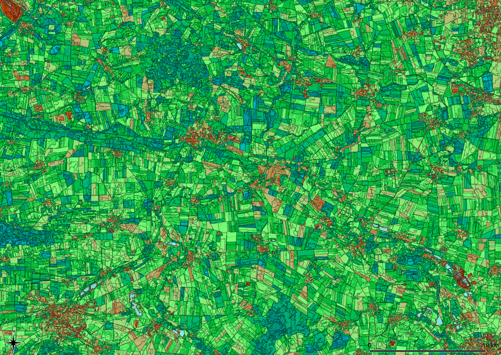

## T3	Indices and Pixel Arithmetics

The ratio of two, three or on rare occasions four bands is traditionally used as an indicator for features that are not directly visible. The most well-known are the vegetation indices (NDVI, EVI, LAI, ...). These indices are based on the reflections at different frequencies (bands) and can be applied to individual pixels.

Besides comparing bands of one image, *Imalys* several includes routines to process time series and to analyze the vicinity of single pixels control the image contrast or record local variability.



Near Infrared Vegetation NIRv at “Hohes Holz” and “Großer Bruch” in the Bode catchment area, Germany. Landsat-8. First half of the growing season 2014-2020. Narrow black lines mark boundaries of land use (*zones*). The NIRv values range between 0.0 (turquoise) and 0.4 (dark green).

A Quantum GIS [color palette]() for NirV is provided. To use this palette, select the "Properties" menu with "Layer", set the "min" and "max" value to 0.0 and 0.4 respectively and select the NirV.qml palette with the "Style" command at the properties menu.

-----

### T3a	Vegetation indices

*Imalys* has implemented two vegetation indices, one for the metabolic rate of green plants (*NIRv*) and one for the relative coverage of the landscape with green leaves (*NDVI*). The user should take into account that all vegetation indices are approximations. They assume spectral dependencies and also depend on the type of sensor.

In addition to special data sources, there are numerous other methods to derive proxies for features such as soil moisture from the visible image data. 

```
IMALYS [tutorials 3a]
home
	directory=/home/»user«/.imalys
	log=/home/»user«/ESIS/results
compile
	period=20220801-20221031
reduce
	select=compile
	execute=bestof
reduce
	select=bestof
	execute=NirV
	execute=NDVI
	red=2
	nir=3
export
	select=NirV
	target=/home/»user«/ESIS/results/NirV.tif
export
	select=NDVI
	target=/home/»user«/ESIS/results/NDVI.tif
```

»user« must be exchanged with the path of the tutorial!

The results of tutorial 2d must be available at the working directory!

---

Tutorial 3a demonstrates how to rearrange intermediate results to two different pixel indices. The [compile]() process must be repeated to select images of the first half of the vegetation period. The first [reduce]() creates an optimized 6 band image.

The second [reduce]() calculates the vegetation index *NDVI* and the plant metabolism index *NirV*. To calculate the indices, the position of the red and the near infrared bands within the image must be given as a number, starting with zero for the upmost layer (green). If the input images are identical, the [reduce]() commands can be concatenated. Two [export]() commands save the results as Geo-Tiff files in the *results* directory.

Different months given under [compile]() and [export]() can create the same indices for the second half of the vegetation period 2022.

-----

[Previous](3_Pixel.md) – [Index](Index.md) –[ Next](3b_TimeSeries.md)

