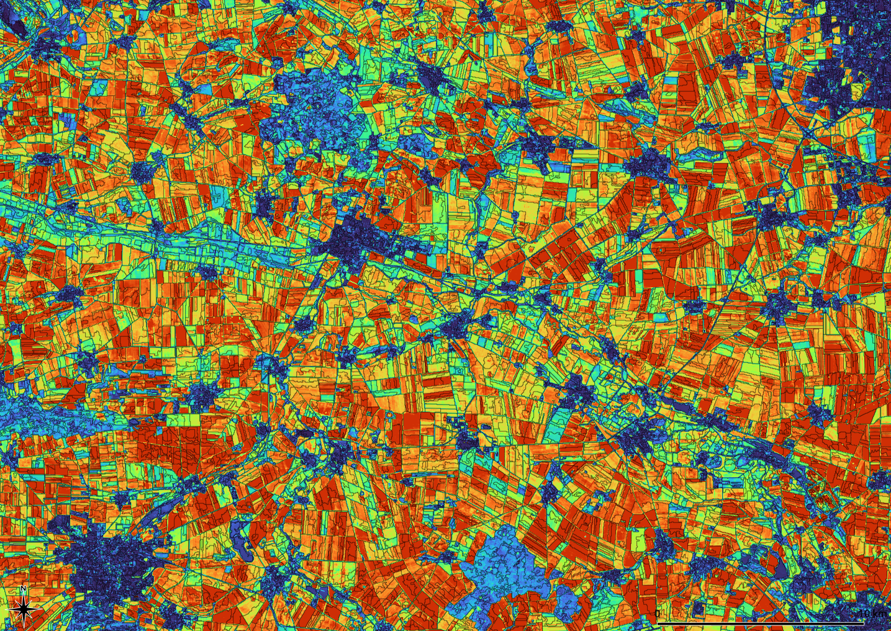

### T3b	Time series and change

Image data from remote sensing are snapshots that show arbitrary differences. All tutorials above use a short time course to return “typical” image values for the given period (see [Median](../manual/5_Reduce.md). Sentinel 2 and Landsat 8 have been in operation since 2016 and 2014 respectively. Typically 1 to 3 usable images are available for three months. Landsat sensors (TM and OLI) allow time series over 40 years.



Variance of mean values over the growing season 2014-2020: “Hohes Holz” and “Großer Bruch” in the Bode catchment area, Landsat-8, Growing season 2014-2020. Values between 0.0 (blue) and 0.52 (red). Small changes in settlement and forest areas are clearly visible.

---

To analyze changes over a longer period *Imalys* provides the *difference*, *variance* and the *regression* processes. *Difference* simply returns the arithmetical difference between the given images. Corresponding bands are calculated individually.

→ Keep in mind:

→ variance pure = seasonal differences

→ variance constant season = annual change

Given a stack of at least three images the *variance* calculates the “variability” of each pixel using the Gaussian formulae. *Regression* quantifies a linear trend in time. Both processes calculate each pixel and each band individually. If no time stamp is provided by the [Import](../manual/3_Import.md) command, all images will be treated as of equal distance. Strictly speaking both formulae assume a normalized distribution of the values.

To reduce the statistical results for different bands to one value for each pixel, the *principal* or the *mean* process can be used.

```
IMALYS [tutorial 3b]
home
	directory=/home/»user«/.imalys
	clear=true
	log=/home/»user«/ESIS/results
import
	database=/home/»user«/ESIS/archives/center.csv
	distance=1.00
	period=20220501-20221031
	frame=/home/»user«/ESIS/frames/bounding-box.shp
	cover=0.9
	quality=0.86
	bands=_B2, _B3, _B4, _B5, _B6, _B7
	factor=2.75e-5
	offset=-0.2
	warp=32632
	pixel=30
compile
	period=20220501-20221031
reduce
	select=compile
	execute=variance
export
	select=variance
	target=/home/»user«/ESIS/results/Variance_bands.tif
reduce
	select=variance
	execute=principal
export
	select=principal
	target=/home/»user«/ESIS/results/Variance.tif
```

»user« must be exchanged with the home directory of the user

---

Tutorial 3b	shows how to calculate the variance of the seasonal differences during one year. To get the differences of the whole vegetation period all images from May to October 2022 are extracted once again and compiled to one large stack. If you look at the metadata at *~/.imalys/compile.hdr* you can see how *Imalys* records sensor, type and date of the different bands.

The *regression* process can be called exactly in the same way. As the *variance* will show the magnitude of the changes, the *regression* will indicate the direction. If longer time periods should be examined, also the typical values of short time periods like the results of the above tutorials can be used.

-----

[Previous](3a_Vegetation.md) – [Index](Index.md) –[ Next](3c_Contrast.md)