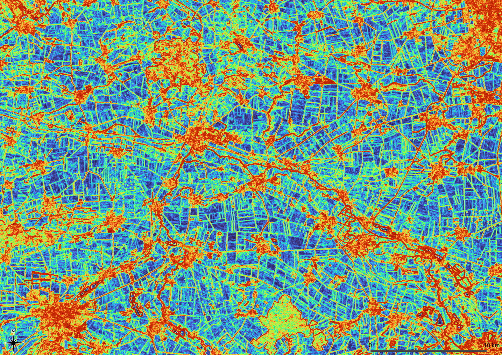

### T3c	Diversity and Contrast

*Kernel* processes assign a new value to each pixel. The new value is compiled from a small window (kernel) and assigned to the central pixel of the kernel. *Kernels* can be used to determine the local roughness of an image but also to modify the contrasts or enhance an elevation model.



First principal component of the normalized textures at “Hohes Holz” und “Großer Bruch” in the Bode catchment area: All optical bands in a 5x5 kernel; Sensor: Landsat-8; Values: 0 (blue) to 0.42 (red); Growing season 2014-2020

---

In terms of biology, **diversity** is defined as the probability to record different species in one place. Indicators of landscape diversity have been a focus of our development. *Imalys* provides different methods to estimate landscape diversity from image data.

Spectral diversity or texture is traditionally used as a measure of ecological diversity in remote sensing. *Imalys* provides additional methods to quantify spatial distribution, shape and temporal changes of depicted structures. 

**Textures** return the “roughness” of an image. In the simplest case, this is the spectral difference between adjacent pixels in a small window (kernel). The [kernel](../manual/6_Kernel.md) is systematically dragged over the whole image. Each *kernel* defines one result pixel. In addition to the classic texture, the normalized texture (*normal*) and the Inverse Difference Moment according to Haralik⁵ (*inverse*) are implemented.

Structural features of image data can be strengthened or weakened using kernels. Imalys implements a Laplace transformation to amplify small-scale structures (*laplace*) and vice-versa, a LowPass filter with a Gaussian kernel to enhance larger structures and reduce noise (*LowPass*)

```
IMALYS [tutorial 3c]
home
	directory=/home/»user«/.imalys
	clear=false
	log=/home/»user«/ESIS/results
compile
	select=/home/»user«/ESIS/results/Bands_summer.tif
	select=/home/»user«/ESIS/results/Bands_autumn.tif
kernel
	select=compile
	execute=lowpass
	execute=laplace
	radius=2
export
	select=lowpass
	target=/home/»user«/ESIS/results/LowPass.tif
export
	select=laplace
	target=/home/»user«/ESIS/results/Laplace.tif
```

»user« must be exchanged with the name of the user

the result of the of tutorial 3b must be retained (*clear=false*)

---

Tutorial 3c shows how to calculate two different [kernel](../manual/6_Kernel.md) processes. Both use the same input and store their result with the name of the process at the working directory. The *lowpass* kernel returns a reduced contrast and may visualize larger structures. The *laplace* transformation uses a “Mexican head” function to enhance contrast and visualize borders. All *kernel* processes use the first principal component of all input bands to calculate their result. The [export](../manual/11_Export.md) command stores the result as Geo-Tiff at the *results* directory.

-----

[Previous](3b_TimeSeries.md) – [Index](Index.md) –[ Next](3d_Periods.md)

