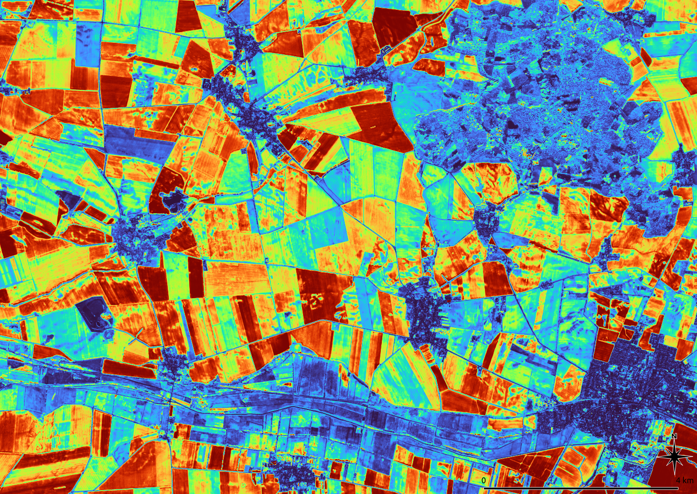

### T3d	Seasonal periods

In mid-latitudes there are pronounced seasonal periods with changes often greater than the changes over years. On the one hand the seasonal changes themselves can be of interest (see [T3b: Time series and change](3b_TimeSeries.md)).

In order to depict typical features, trends or outliers, the season of the images should be taken into account. For long time series images of the same season should be preferred. We got no problems to collect enough images for two 40 years time series of Germany, one based on images for May to July, the other for August to October. The results allow to map long and short time developments with the same datasets. An example for a 5 years period is depicted below.

Variance of Seasonal Differences ⬥ Time periods May – July and August – October over the years 2017 to 2021 ⬥ Settlements show the smallest seasonal variance, forest (NO) and permanent grassland (S) moderate variance ⬥ Agriculture show all grades (harvest) ⬥ Sensor: Sentinel-2 ⬥  Years: 2017-2021 ⬥ Bands: 2, 3, 4, 8 ⬥ Values: 0.0 (Blue) – (Red) 0.014

The extent and direction of periodic changes are a specific feature of many landscape types. Settlement areas show little periodic change, deciduous forests show significant but regular fluctuations and arable land both changes, high and irregular due to harvesting. Permanent grassland can be depicted by its periodicity.

In the above image water induced periodical changes of the arable land become visible in the right half of the image.

-----

[Previous](3c_Contrast.md) – [Index](Index.md) –[ Next](3e_Outliers.md)
