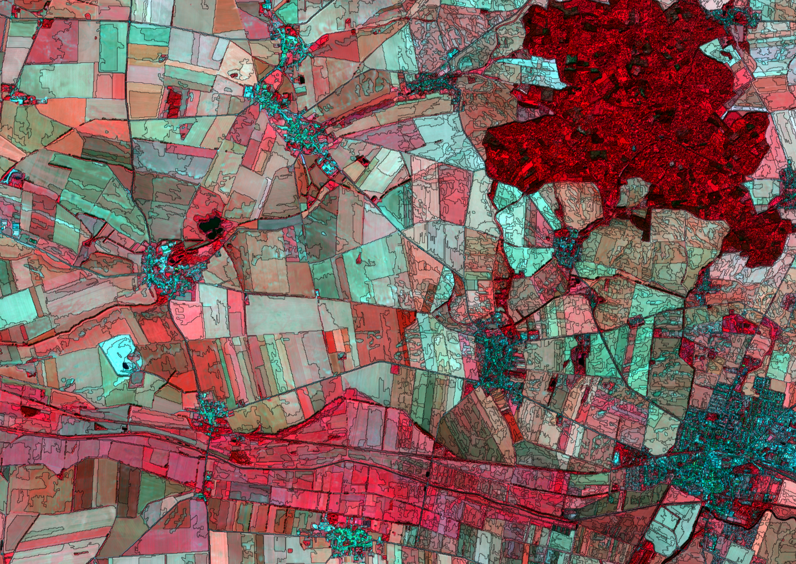

## T4	Natural Borders (Zones)

### T4a	Border delineation

With pattern analysis of the image, areas with mostly the same optical characteristics can be defined. They are hereinafter referred to as [zones](../manual/7_Zones.md). This technique is also known as Object Based Image Analysis (OBIA) (Blaschke 2014). The process only depends on the image data and a parameter for the mean size of the *zones*. *Zones* have a geometry, attributes and individual neighbors. The borders between zones represent borders of land use. The local density of landuse borders is used as an ecological indicator (“effective mesh size” or “coherence degree” (Jaeger 2001)). 



Structural landscape elements at “Hohes Holz” and “Großer Bruch” in the Bode catchment area (Germany) ⬥ Zones with different combinations of optical characteristics are marked by dark narrow lines ⬥ Once created, zones can be processed separately from the image data ⬥ Landsat-8 images ⬥ first half of the growing season 2014-2020

-----

The process is based on an algorithm to minimize the **variance** within the zones. Details are explained at [background](). The algorithm can process any type of image, regardless of the image source (microwave, altitude data, light), the scale or the number of bands.

The **average size** of the [zones](../manual/7_Zones.md) *size* can be freely selected. The process starts with *zones* of individual pixels and gradually removes borders between existing *zones* until a threshold is reached. The order in which the borders are removed does not depend on the final size. This means that larger *zones* can act as a second-degree order for smaller ones. Larger *zones* inherit the borders of the smaller ones. 

If bands with very different **value ranges** are used, the bands with the largest numerical values dominate the position of the border. It may be useful to *scale* the values of the different bands before processing so that all features will have the same influence on the result.

The internal representation of the *zones* is an image with the zone ID as a value (*~/.imalys/index*), a WKT file with the coordinates of the borders (*~/.imalys/vector.csv*), an attribute table (*~/.imalys/index.bit*) and a table of all the links between adjacent zones (*~/.imalys/topology.bit*).

```
IMALYS [tutorial 4a]
home
	directory=/home/»user«/.imalys
	clear=true
	log=/home/»user«/ESIS/results
compile
	select=/home/»user«/ESIS/results/Bands_summer.tif
	select=/home/»user«/ESIS/results/Bands_autumn.tif
zones
	select=compile
	bonds=low
	size=30
export
	select = index
	target = /home/»user«/ESIS/results/Zones.shp
```

»user« must be exchanged with the home directory of the user!

-----

Totorial 4a shows how to create zones and export them as polygons. In contrast to the previous examples the image data are taken from an earlier result. [Compile](../manual/4_Compile.md) will bring the images back to the working directory. 

The [zones](../manual/7_Zones.md) process creates a raster mask *index* at the working directory together with an attribute table *index.bin* and a size and contact database for all *zones* *topology.bit*. The [export](../manual/11_Export.md) process stores them as a geometry file with attributes. The ending of the *target* filename controls the file format.

Size and shape of the zones should fit your intentions. *Bonds=high* will restrict the differences in size between all *zones*. *Size* will restrict the mean size of the zones. No entry combination will fit all purposes. It is convenient to test different entries of the parameters *bonds* and *size*. To simplify the comparison a *zones.shp* file is created at the working directory even if no [export](../manual/11_Export.md) is induced.

Zones can be created as cascades where smaller zones fill larger ones without interference (see [zones](../manual/7_Zones.md)).

-----

[Previous](3f_Entropy.md) – [Index](Index.md) – [Next](4b_Features.md)
