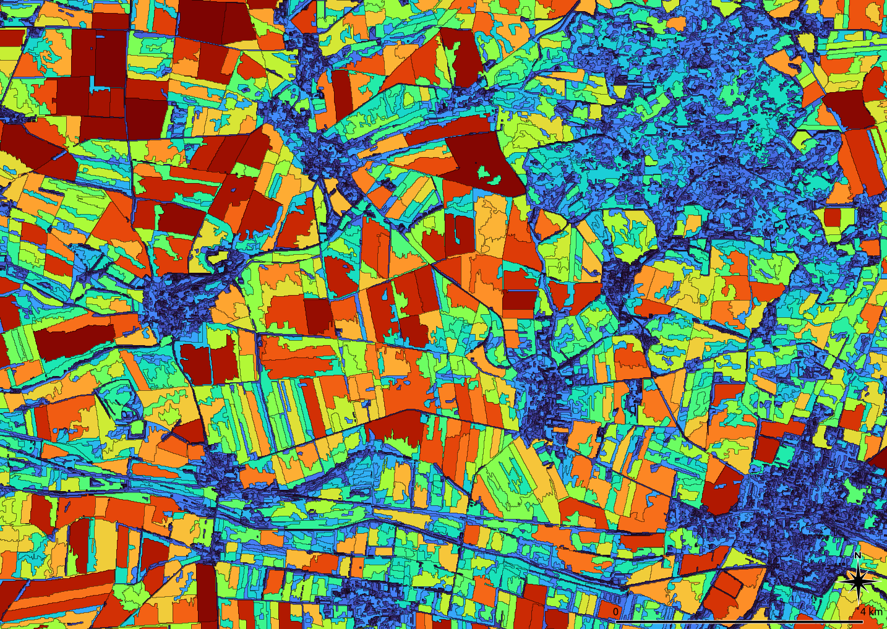
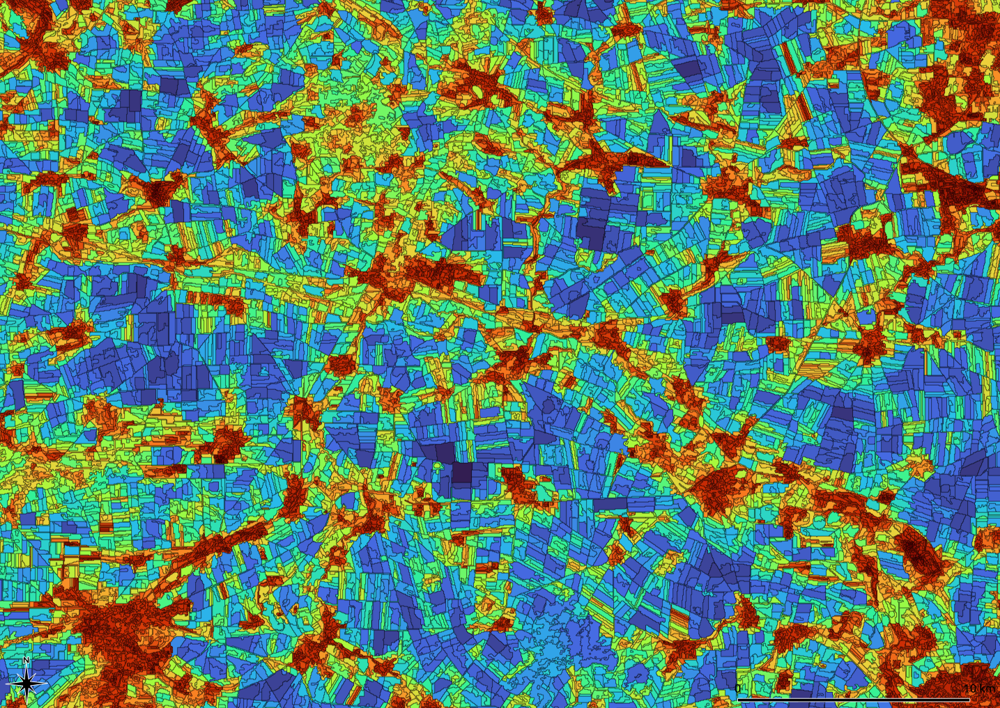

### T4b	Spectral and structural features

Spectral features are calculated as the mean of all pixels within one [zone](). Structural features can be derived from the geometry and the connection of the *zones*. Some features describe individual zones such as *size* (area) or *dendrites* (shape), others describe the connections to adjacent *zones* such as *relation* (density of neighbors) or *diversity* (spectral differences). New [features]() can rely on images that where not included in the delineation of the *zones*.



Dendritic Cell Form: Ratio of volume and area of single zones ⬥ Small or narrow zones have small values, large or compact zones have large values ⬥ The quotient does not depend on the parameters of the cell formation ⬥ Process: Dendrites ⬥  Values: 0.05 – 1.0 (blue – red) ⬥  Location: Bode catchment area ⬥ Sensor: Sentinel-2 ⬥  Years: 2017-2021, May – Oct.

-----

[Features]() resets the **attribute table** of the zones geometry. The shape and connections of the zones are obtained directly from the geometry of the zones. In addition, arbitrary image data such as height or [kernel]() results can be linked to the zones as new attributes. *Features* was therefore implemented as an independent process. 

The ***size*** of the zones depends on a selectable parameter and thus it cannot be used to compare images. Therefore all other structural attributes return relative values that are less dependent of the absolute size of the zones.

Two other processes compare the shape and size of the zones with the **local environment**. *Proportion*  gives the ratio of the central zone to all connected zones. The value is greater than one if the central zone is larger than the mean of the neighbors. *Relation* gives the ratio between the perimeter and the number of connected [zones](). 

Usually the shape and size of the [zones]() are not randomly **distributed**, they form regions or corridors with similar characteristics. *Diffusion* strengthens locally dominant features in a similar way to a low pass filter and thus makes focal points more visible. The algorithm follows Alan Turing’s suggestion to understand patterns as a consequence of diffusing fluids.



Local concentration of the *dendrites* attribute ⬥ Regional balance of values over 5 levels enhances the visibility of focal points and corridors ⬥ Process: Dendrites ⬥  Process: Dissemination ⬥ Years: 2014 – 2020 ⬥ Values: 0.09 – 5.6 (red – blue) ⬥ Sensor: Landsat-8 ⬥ Site: Bode catchment area (Germany)

-----


If corridors, i.e. paths with favorable conditions for exchange, are to be found, a hydrological drainage model [runoff]() is available, which does not only have to use elevation data. A classification ([mapping]()) including image objects can also be used to record large scale spatial links.

```
IMALYS [tutorial 4b “features”]
home
	directory=/home/»user«/.imalys
	log=/home/»user«/ESIS/results
compile
	select=/home/»user«/ESIS/results/Bands_summer.tif
	select=/home/»user«/ESIS/results/Bands_autumn.tif
	select=/home/»user«/ESIS/results/NirV.tif
	select=/home/»user«/ESIS/results/LowPass.tif
features
	select=compile
	execute=entropy
	execute=normal
	execute=cellsize
	execute=dendrites
	execute=proportion
	execute=relation
	execute=diversity
export
	select = index
	target = /home/»user«/ESIS/results/Zones.shp
```

»user« must be exchanged with the home directory of the user!

The results of earlier tutorials must be retained!

-----

 Tutorial 4b shows how to create an attribute table from images and the geometry of the [zones](). The images must exist. If more than one image should be transferred, all images must be stacked using the [compile]() command and selected as one image. Shape, size and connection of the *zones* only relay on the geometry of the *zones*. They are created by the given parameters like *dendrites* or *proportion*. 

Some features like *diversity* relay on both, spectral and geometrical features. Without spectral input they will not work (see [features]()). The [export]() command links geometry and attribute table of the *zones*. To work with the *export* is mandatory.

-----

[Index](Index.md)
