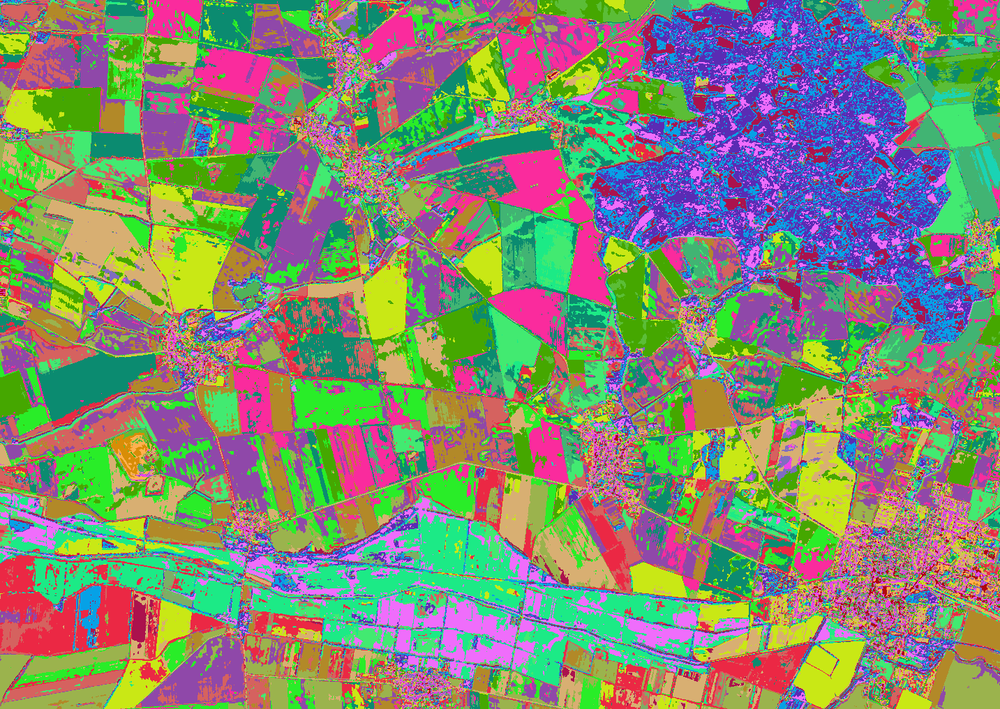

## T5	Objects and Classification

### T5a	Pixel based classification

Imalys provides a fully automatic classification of image features [mapping](). The process can use pixels or zones and in an advanced version zones can be combined to *objects*.



Self-adjusting classification ⬥ 30 spectral combinations (patterns) separated by a fully automatic process according to Teuvo Kohonen ⬥ The colors shown are random ⬥ Sensor: Sentinel-2 ⬥ Years: 2017-2021 ⬥ Bands: 2, 3, 4, 8 ⬥ Seasons: May – July and August – October ⬥ Process: Mapping ⬥ Color code: Random ⬥ Values: Classes 1...30

-----

Deriving basic land use types from image data can be unreliable because land use types are defined by their purpose and not by their appearance in the image. **Machine learning** can recognize almost any pattern, but needs to be trained using examples. Only trained patterns can be recognized. The training might even take longer than manual classification.

Imalys implements methods to arrange image features of all kinds into separate groups or clusters ([mapping]()). The result reflects feature combinations that are common in the classified image. *Mapping* can classify images at three levels: 

1. Pixels based on their spectral combinations
2. Zones based on the zones attributes
3. Objects based on the connections of classified zones

The principle is the same in each case. Features or properties create a multidimensional feature space. Local concentrations of feature combinations are detected and classified using a neural network as suggested by Teuvo Kohonen (Kohonen’82)

The unsupervised classification of pixels based on spectral combinations is a standard procedure ([mapping]()). The result mainly depends on the selection and quality of the image base (see [reduce]()).

```
IMALYS [tutorial 5a]
home
	directory=/home/»user«/.imalys
	clear=true
	log=/home/»user«/ESIS/results
compile
	select = /home/»user«/ESIS/results/Bands_summer.tif
	select = /home/»user«/ESIS/results/Bands_autumn.tif
mapping
	select=compile
	model=pixels
	classes=14
	samples=14000
export
	select = mapping
	target = /home/»user«/ESIS/results/Automap.tif
```

Tutorial 5a shows how to classify a multispectral and multitemporal image for 14 spectral clusters. The images at the *result* folder must exist. The *model* parameter selects a pixel based classification, 14 different *classes* are selected. The *samples* are used to train the classifier. The number of the *samples* should be about 1000 times larger than *classes*. If rare features should be classified, a higher number might be necessary.

[Mapping]() stores the result image and the class definition to the working directory. [Export]() saves both as *Automap.tif* to the *results* directory of the user.

-----

[Index](Index.md)