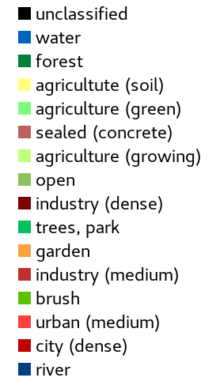

### T5b	Zone based classification

[Zones]() must be created before the classification but *zones* properties can provide additional features derived from the size, shape and connections of the *zones*. The spectral features of *zones* are the mean of all pixels that contribute to the zone. *Zones* and classes complement each other. *Zones* summarize typical pixel features for a limited area. Classification sorts them into a manageable list of feature combinations. Typical problems with clustering pixels such as “pepper and salt” patterns do not occur anymore.


Attributes and spatial patterns of 30 self-calibrating classes were assigned to 16 final classes ⬥ Image data: Sentinel-2 ⬥ Date: 16.9.2018 ⬥ Bands: 8-4-3-2 ⬥ Process: Mapping ⬥ Values: Classes (see legend) 

​	

```
IMALYS [tutorial 5b]
home
	directory=/home/»user«/.imalys
	clear=true
	log=/home/»user«/ESIS/results
compile
	select = /home/»user«/ESIS/results/Bands_summer.tif
	select = /home/»user«/ESIS/results/Bands_autumn.tif
zones
	select=compile
	bonds=low
	size=30
features
	select=compile
mapping
	select=index
	model=zones
	classes=14
	samples=14000
export
	select=mapping
	target=/home/»user«/ESIS/results/Mapping.tif
```

Tutorial 5b shows how to classify zones instead of pixels. The image input is taken from an earlier result. Alternatively all images stored at the working directory can be selected directly by [zones](). To classify zones with the [mapping](../manual/9_Mapping.md) command, the raster part (*index* and *index.hdr*) of the zones definition must be called. The classification result *mapping* can be exported as usual. Different classes are visualized by a color palette.

-----

[Index](Index.md)

