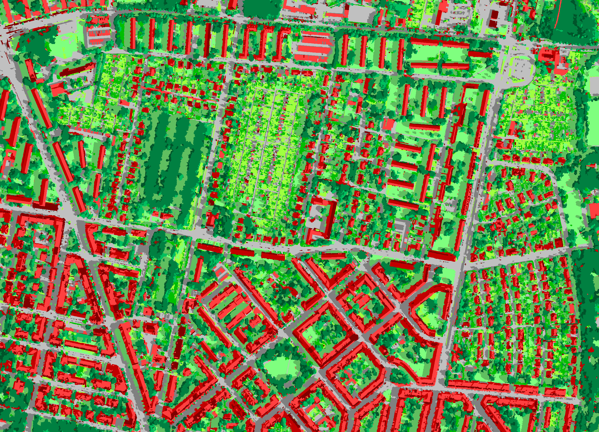
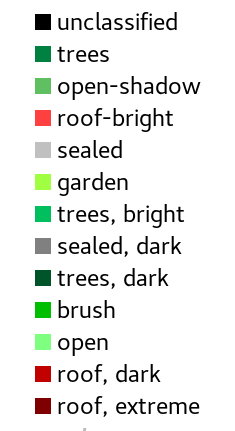

### T5c	Object based classification

Classified zones can be combined by a second level classification to form “objects” (→mapping). Objects are only defined by the frequency or intensity of the connections between their zones. The connection intensities form characteristic patterns that can be classified. The result describes a typical pattern of different spectral and spatial combinations. These classes are hereinafter referred to as “objects”. For details see the “Methods” section.



Spatial patterns from different zones were reduced by a self-calibrating analysis to 30 patterns, which were assigned to 13 different classes ⬥ Image data: Infrared aerial photos and elevation model of the State of Saxony ⬥ Legend:



-----

The **objects size** is not limited. Simple patterns of small [zones]() can be repeated over a large area to form one large *object*. Large *zones* usually form *objects* of one dominant zone class and many smaller ligands. In practice the size of the *zones* should be selected in such a way that homogeneous *objects* are not reduced to many *zones*, whereas heterogeneous *objects* can be represented by a sufficient number of smaller *zones*.

```
IMALYS [tutorial 5c]
home
	directory=/home/»user«/.imalys
	clear=true
	log=/home/»user«/ESIS/results
compile
	select = /home/»user«/ESIS/results/Bands_summer.tif
	select = /home/»user«/ESIS/results/Bands_autumn.tif
zones
	select = compile
	bonds=low
	size=30
features
	select=compile
mapping
	select=index
	model=fabric
	classes=14
	samples=30000
export
	select=mapping
	target=/home/»user«/ESIS/results/Objects.tif
```

Tutorial 5c: The call of an object based classification is almost identical to a zones based one even if the internal processes differ considerably. The only real difference is the *double* option (not shown) that will extend the search for connected zones. 

-----

[Index](Index.md)

